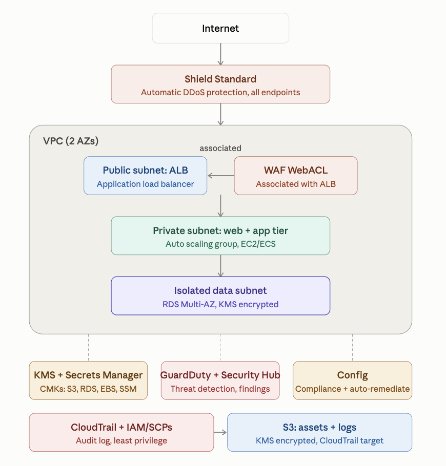
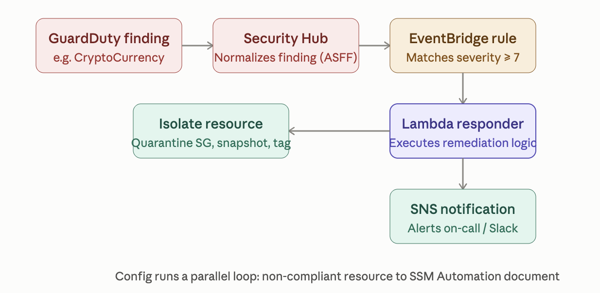

# Secure Multi-Tier Architecture with GuardDuty, KMS & Security Hub

This is an AWS Security Specialty style design and documentation project built around a secure, multi tier application architecture, defended with layered detective and preventive controls across KMS, Secrets Manager, GuardDuty, Security Hub, Config, CloudTrail, WAF/Shield, and IAM/SCPs.

## Table of Contents

- [Overview](#overview)
- [Scope & Approach](#scope--approach)
- [Architecture Diagram](#architecture-diagram)
- [Security Controls Deep Dive](#security-controls-deep-dive)
- [Incident Response Walkthrough](#incident-response-walkthrough)
- [Compliance Mapping](#compliance-mapping)

## Overview

This architecture defends a three tier web application's data and control plane against unauthorized access, data exfiltration, and configuration drift, using layered detective and preventive controls rather than a single perimeter. It maps directly to the AWS Well-Architected Framework's Security Pillar (identity foundations, defense in depth, automated response, data protection) and to the SAA-C03 exam's Security domain (encryption at rest and in transit, IAM least privilege, threat detection, and compliance monitoring).

## Scope & Approach

The architecture described here was designed and documented in detail, but it was **not deployed to a live AWS account**.

## Architecture Diagram



*Solution architecture. Traffic enters through Shield Standard (automatic DDoS protection at the network edge, applied to all endpoints) before it ever reaches the VPC. Inside the VPC, across two AZs, there's a WAF WebACL associated directly with the public subnet ALB, a private web/app subnet (Auto Scaling Group, EC2/ECS), and an isolated data subnet (RDS Multi-AZ, KMS encrypted). Below the VPC, the cross cutting security services, KMS plus Secrets Manager, GuardDuty plus Security Hub, Config, CloudTrail plus IAM/SCPs, and the S3 assets/logs bucket, apply governance across all three tiers (the dashed lines) rather than sitting in the request path. The one exception is the solid arrow from CloudTrail to S3, its actual log delivery target.*



*Incident response flow. There are two independent automated paths. A GuardDuty finding is normalized by Security Hub into ASFF, matched by an EventBridge rule on severity 7 or higher, and handed to a Lambda responder that executes containment (quarantine the security group, take a snapshot, apply a tag) in parallel with an SNS notification. Separately, AWS Config runs its own loop: a non-compliant resource triggers an SSM Automation document directly, without going through GuardDuty, Security Hub, or Lambda at all. See [Incident Response Walkthrough](#incident-response-walkthrough) for the full sequence.*

## Security Controls Deep Dive

### KMS

*(This is design detail beyond what the diagram shows, except where noted. The diagram confirms all four CMKs, for S3, RDS, EBS, and SSM, through the KMS box's "CMKs: S3, RDS, EBS, SSM" subtitle, and separately confirms S3 and RDS are individually KMS encrypted. The specific policy grants, the `kms:ViaService` condition, and the JSON snippet below are elaboration beyond that.)*

**Decision:** four separate customer managed keys, one each for S3 (the assets/logs bucket shown in the architecture diagram), RDS (database storage), EBS (compute tier volumes), and SSM Parameter Store (SecureString config), instead of one shared CMK. Each key protects a different data category with a different owner, access pattern, and blast radius. A compromised compute tier instance profile can only exercise EBS decrypt rights, never database or config secret decrypt rights, and CloudTrail's `kms:Decrypt` history for each key stays specific to that data category instead of getting polluted by unrelated activity.

Each key's policy grants the account root full administrative access, and grants exactly one narrowly scoped role `kms:Decrypt`, `kms:GenerateDataKey`, and `kms:DescribeKey`, never `kms:*`, restricted with a `kms:ViaService` condition so that role can only use the key through the one AWS service that legitimately needs it, not through a direct API call against arbitrary ciphertext.

```json
// [Illustrative] RDS CMK policy statement
{
  "Sid": "AllowAppTierUseViaRDS",
  "Effect": "Allow",
  "Principal": { "AWS": "arn:aws:iam::<account-id>:role/app-tier-role" },
  "Action": [
    "kms:Decrypt",
    "kms:GenerateDataKey",
    "kms:DescribeKey"
  ],
  "Resource": "*",
  "Condition": {
    "StringEquals": {
      "kms:ViaService": "rds.us-east-1.amazonaws.com"
    }
  }
}
```

### Secrets Manager

*(The diagram confirms Secrets Manager and rotation exist. The cadence, resource policy, and runtime fetch specifics below are elaboration.)*

**Decision:** the RDS master credential lives in one secret, encrypted with the RDS CMK above, and rotates automatically on a 30 day schedule via the AWS provided single user RDS rotation Lambda pattern. The application tier fetches the credential at **runtime** on each new connection, with short TTL client side caching, rather than injecting it as a boot time environment variable. A boot time env var would keep using the old password until every instance or task is restarted, silently defeating rotation, and would leave the plaintext value sitting in the task definition, launch template, and any crash dump or debug log for the life of the instance.

A resource policy on the secret, not just IAM, denies plaintext `GetSecretValue` to everything except the app tier role and the rotation Lambda's role, and denies access entirely from outside the account.

### GuardDuty

**Decision:** enabled account wide with S3 protection turned on. The S3 assets/logs bucket shown in the architecture diagram is a realistic exfiltration target, and findings are routed to Security Hub for consolidation and, from there, to EventBridge for automated response (see [Incident Response Walkthrough](#incident-response-walkthrough)) rather than left sitting in the GuardDuty console. GuardDuty's EKS Protection feature is out of scope for this design, since the compute tier in the architecture diagram is EC2/ECS based and there's no EKS workload for that feature to cover. That's a scope decision that follows from what's actually built, not a claim that the diagram confirms EKS doesn't exist anywhere.

### Security Hub

**Decision:** Security Hub acts as the single aggregation point for GuardDuty and Config findings, with the CIS AWS Foundations Benchmark and the AWS Foundational Security Best Practices standards both enabled. Two standards rather than one, deliberately: CIS gives an industry recognized baseline reviewers will already know how to read, while the AWS native standard catches service specific misconfigurations CIS doesn't cover.

### Config

**Decision:** Config does two jobs here, both shown in the architecture diagram's "Compliance + auto-remediate" label. First, continuous evaluation rather than a point in time check, using a targeted set of managed rules chosen to match the controls that matter most in this architecture, including `rds-storage-encrypted`, `encrypted-volumes`, `s3-bucket-public-read-prohibited`, and `iam-user-mfa-enabled` (design detail beyond what the diagram shows; the full list is in [Compliance Mapping](#compliance-mapping)). This catches drift after deployment, a resource created correctly today but changed out of band six weeks later, which a one time `terraform validate` pass structurally cannot. Second, auto-remediation: a resource Config evaluates as non-compliant triggers an SSM Automation document directly, on its own loop, independent of the GuardDuty/Security Hub/Lambda path described in [Incident Response Walkthrough](#incident-response-walkthrough).

### CloudTrail

**Decision:** a single multi region trail with log file validation enabled (design detail beyond what the diagram shows), delivering its logs to the S3 assets/logs bucket shown in the architecture diagram, the same bucket protected by the S3 CMK above. The diagram draws this as its one explicit data flow arrow outside the VPC, from CloudTrail to S3. Multi region is non negotiable for an account level audit trail: a single region trail would silently miss any action taken through a different region's endpoint, including many IAM and STS calls, which are global but can still be invoked regionally. CloudTrail is also the evidentiary backbone that GuardDuty and the incident response Lambda both depend on.

### WAF + Shield

**Decision:** these are two separate controls at two separate points in the path, not one bundled edge layer. The WAF WebACL is associated directly with the ALB, not with a CloudFront distribution in front of it, since this design has no CDN layer, and it enforces the AWS Managed Core rule group, the SQL injection managed rule group, and one custom rate based rule for basic L7 flood and brute force protection (design detail beyond what the diagram shows) on every request that reaches the public subnet. Shield Standard sits further upstream, at the true network edge before traffic ever reaches the VPC, providing automatic, always on DDoS protection across all endpoints regardless of whether the WAF WebACL evaluates the request at all. Shield Standard, included at no extra cost, is judged sufficient here rather than Shield Advanced. Advanced's cost and its DDoS Response Team engagement make more sense for a business critical, high traffic production workload, not for a single account portfolio architecture with no real traffic.

```json
// [Illustrative] WAF rate-based rule sketch
{
  "Name": "RateLimitPerIP",
  "Priority": 1,
  "Action": { "Block": {} },
  "Statement": {
    "RateBasedStatement": {
      "Limit": 2000,
      "AggregateKeyType": "IP"
    }
  }
}
```

### IAM / SCPs

*(The diagram confirms IAM/SCPs enforce least privilege generically. The per tier role split and the specific SCP examples below are elaboration.)*

**Decision:** every tier runs under its own narrowly scoped role, with no shared "app role" spanning compute and database access, and Service Control Policies at the AWS Organizations level provide a preventive backstop on top of those roles. For example, they deny anyone, including an account admin, from disabling GuardDuty or Config, or from creating unencrypted EBS volumes or RDS instances, account wide. The SCP layer exists specifically so that a single over permissioned IAM policy elsewhere can't quietly disable the detective controls this whole design depends on.

## Incident Response Walkthrough

Full detection to resolution steps live in [`docs/runbook.md`](docs/runbook.md).

### GuardDuty path

The diagram's worked example is a **CryptoCurrency** finding, crypto mining activity detected on a resource. GuardDuty publishes the finding to Security Hub, which normalizes it into ASFF (AWS Security Finding Format). An EventBridge rule matching on **severity 7 or higher** picks up the normalized finding and invokes the incident response Lambda. The Lambda executes containment directly, quarantining the resource's security group, taking a snapshot, and tagging it, in parallel with publishing an SNS notification that alerts on call and Slack. A human responder then follows the escalation steps in the runbook to confirm root cause, decide on further containment, and close out the finding. The automation handles speed of first response and evidence preservation, not the full investigation.

### Config path

Separately, AWS Config runs its own auto-remediation loop: a resource Config evaluates as non-compliant against one of its rules triggers an SSM Automation document directly, with no Lambda invocation and no human facing notification in between.

## Compliance Mapping

The full control by control mapping, showing which CIS AWS Foundations Benchmark control ID and PCI DSS requirement each decision above satisfies, along with its current status, lives in [`docs/compliance-mapping.md`](docs/compliance-mapping.md).
